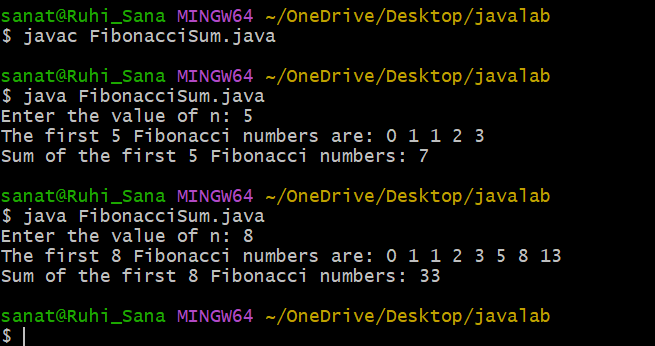

# ADD2
## AIM:
``` java
import java.util.Scanner;

public class FibonacciSum {
    public static void main(String[] args) {
        Scanner sc = new Scanner(System.in);

        // Input
        System.out.print("Enter the value of n: ");
        int n = sc.nextInt();

        int a = 0, b = 1, c;
        int sum = 0;

        System.out.print("The first " + n + " Fibonacci numbers are: ");

        if (n >= 1) {
            System.out.print(a + " ");
            sum = a;
        }

        if (n >= 2) {
            System.out.print(b + " ");
            sum = sum + b;
        }

        for (int i = 3; i <= n; i++) {
            c = a + b;
            System.out.print(c + " ");
            sum = sum + c;
            a = b;
            b = c;
        }

        System.out.println();
        System.out.println("Sum of the first " + n + " Fibonacci numbers: " + sum);

        sc.close();
    }
}

```
## output:

