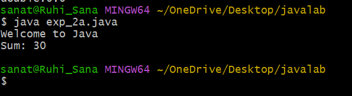

# experiment 2A
## AIM: Implementing class mechanism in java. create class. methods and invoke them inside the main method.

```java
class MyClass {

    void displayMessage() {
        System.out.println("Welcome to Java");
    }

    int add(int a, int b) {
        return a + b;
    }

    public static void main(String[] args) {

        MyClass obj = new MyClass();

        obj.displayMessage();

        int result = obj.add(10, 20);
        System.out.println("Sum: " + result);
    }
}
```
## output


